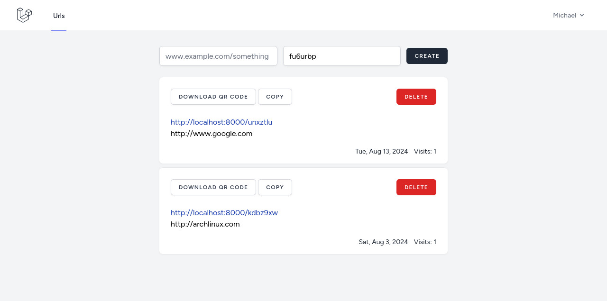

# Shorty
A url shortner web application built with laravel and livewire

# Running
### Clone the repository

```sh
git clone https://github.com/michaelcosj/shorty.git
```

### Install dependencies

```sh
composer install
```

```sh
npm install
```

### Run 

```sh
php artisan serve
```

```sh
npm run dev
```

```sh
php artisan queue:listen
```

```sh
php artisan reverb:start
```

# Screenshot

